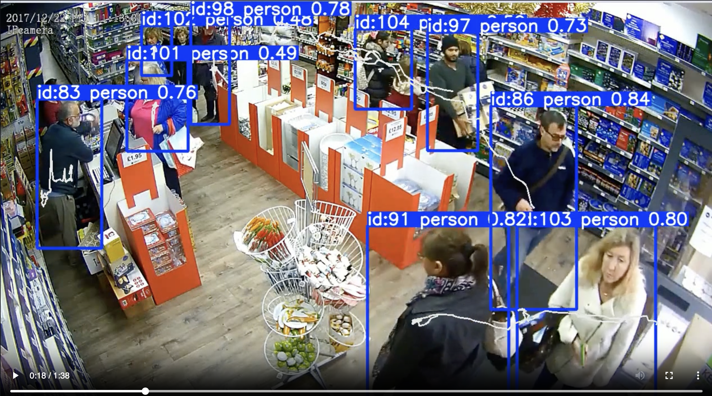
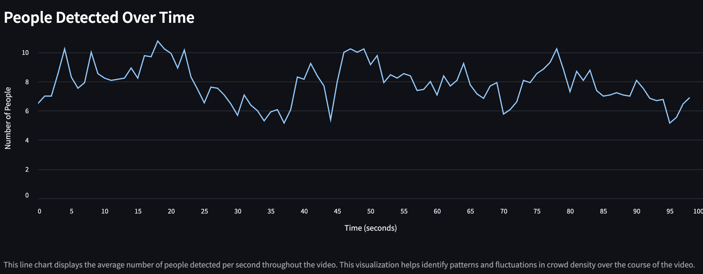

# TrackWiseAI
TrackWiseAI is an advanced computer vision and AI-based analytics system designed to enhance retail store operations by providing comprehensive insights into customer behavior. 
Utilizing video cameras installed in stores, TrackWiseAI detects and tracks the number of people, their positions, movement patterns, and time spent in specific areas.

